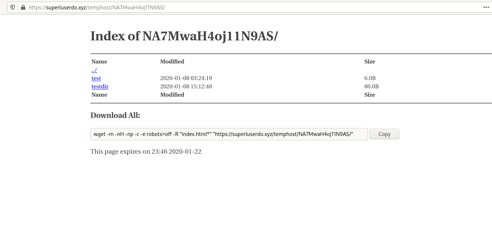

# temphost

Quickly deploy some files to be hosted on a server, without installing software on that server.

----

## Usage

Supply the required command line arguments for the server, and the files will be synced to the specified prefix, along with a customisable automatically generated directory listing.

You may supply a "time to live", in which case the listing page will display how long the files will stay online. This queues up an `at` job to delete the files from the server after this time.

----

## Example:

For the command:

``temphost -r test testdir -t 9``

and config file (~/.config/temphost/config.yaml):

```
hostname : 'my_server_hostname'
server_protocol : 'https'
server_domain : 'superluserdo.xyz'
server_fs_root : 'my_server_root_dir'
listing_prefix : 'temphost'
slug_len : 16
```

temphost copies the file `test` and dir `testdir` to the server at `https://superluserdo.xyz/temphost/<auto-generated slug>/`:



With recursive auto-generated directory listing index.html files with customisable css.

----

## Installation
temphost only needs to be installed to the client (pushing the files), not the server hosting them.


### Arch Linux:
Install ``temphost`` from the AUR

### Manual installation:
Clone this repository and run:
``python3 setup.py install``

Generate the manual with:
``scdoc <temphost.1.scd | gzip - > temphost.1.gz``
``install -D -m 644 "$pkgname.1.gz" "/usr/local/share/man/man1/temphost.1.gz"``

Deps: python3, python-jinja, python-yaml, openssh

Makedeps: python, scdoc (for man page)

### Server requirements:

- ssh access (preferably with an ssh key agent)

- Running any dumb http server that will serve files under a particular server root directory

- If using TTL, the server must have ``atd``

## More examples

- Send files ``file1`` and ``file2`` to the server at hostname "myserverhostname", with URL "https://mydomain.com/temphost/myslug/"

```
python temphost -H myserverhostname -s myslug file1 file2 --server-domain mydomain.com server-fs-root "/srv/www/mysite" --listing-prefix "temphost"
```

(Here the files would be stored on the server at /srv/www/mysite/temphost/myslug/)

- Recursively send file `file1` and directory `dir1` to the server at hostname "myserverhostname", with an autogenerated slug

```
python temphost -r -H myserverhostname file1 dir1
```

(Note that server_domain, server_fs_root and listing_prefix must be specified in the config file here)


## Usage

```
temphost [-h] [-H HOSTNAME] [-r] [-c CONFIG] [-s SLUG] [-t TTL] [-S] [-n] files [files ...]

positional arguments:
  files                 List of files to send over

optional arguments:
  -h, --help            show this help message and exit
  -H HOSTNAME, --hostname HOSTNAME
                        Server to send files to
  -r, --recurse         Recurse into directories (required if sending over directory names)
  -c CONFIG, --config CONFIG
                        Host config file
  -s SLUG, --slug SLUG  URL slug to deploy to (default is a random alphanumeric string)
  -t TTL, --ttl TTL     Time for the files to live in days
  -S, --use-custom-style
                        Use custom CSS file
  -n, --dry-run         Try without transferring files
  --server-domain SERVER_DOMAIN
                        Domain of the server (without http prefix), eg example.com
  --server-fs-root SERVER_FS_ROOT
                        The server root directory, ie the one corresponding to yourdomain.com/
  --listing-prefix LISTING_PREFIX
                        The prefix of all temphost-hosted files on the server, eg "temphost" (would host at example.com/temphost)
```

To avoid having to type lots of command line arguments, copy the config file from /usr/share/temphost/config.yaml.example to ~/.config/temphost/example.yaml, and edit to your liking.
